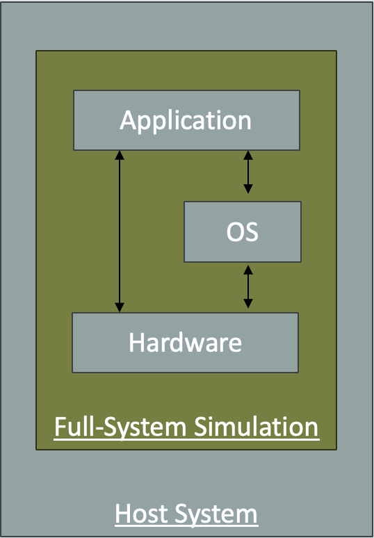
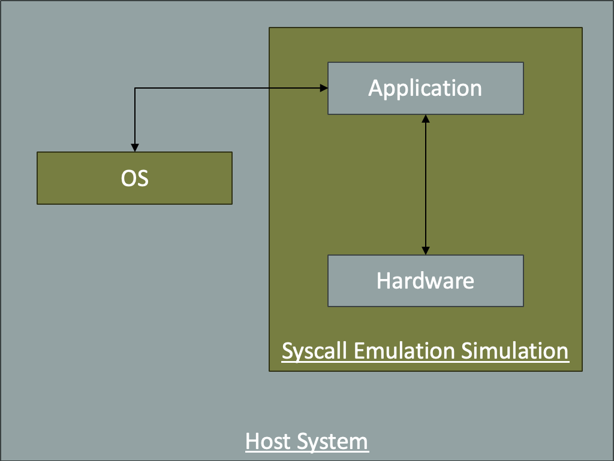

<!-- _class: title -->

## Getting Started with gem5

### A hands-on session for new group members

**Sudipto Ray**

In the next 90 minutes
we will build a simulated computer,
run a real program on it, change its hardware, and measure
what happened.

---

<!-- _class: start -->

## Part 1 — The Model

---

## What problem does gem5 solve?

You want to answer questions like:

- *"If I double the L2 cache, how much faster does this program run?"*
- *"What if DRAM had half the latency?"*
- *"What happens if a memory row gets corrupted?"*

You cannot answer these on real hardware — **the hardware does not exist yet**,
and you cannot change its cache size.

### gem5 simulates a machine that does not exist yet.

You describe a machine, gem5 pretends to be that machine, cycle by cycle,
and tells you exactly what happened inside it.

---

<!-- _class: two-col -->

## Simulation is not emulation

### Emulator (QEMU)

Goal: **run the program**

- "What is the answer?"
- Fast — near native speed
- No notion of a cache
- No notion of a cycle
- Cannot tell you *how long* it took

### Simulator (gem5)

Goal: **model the hardware**

- "How did the hardware behave?"
- Slow — ~100 KIPS to few MIPS
- Models caches, buses, DRAM banks
- Counts every cycle
- Gives you thousands of statistics

---

## The one idea behind everything: discrete events

gem5 does **not** run in real time. It keeps a queue of *events*,
each stamped with the tick it should happen at.

```text
Event queue        (1 tick = 1 picosecond by default)
--------------------------------------------------
tick 1000   CPU issues a load
tick 1002   L1 cache lookup -> miss
tick 1022   L2 cache lookup -> miss
tick 1122   DRAM activates a row
tick 1180   data returns to the CPU
```

The loop is simply: *pop the earliest event, run it, let it schedule new events.*

> "Simulated time" advances by however much the models say. Your wall clock
> is irrelevant to the result — this is why a run is **reproducible**.

---

## The price you pay: speed vs. accuracy

Simulating one second of a real machine can take **hours**.
So gem5 lets you pick how much detail you pay for.

| CPU model | What it models | Use it for |
|:-----|:-----|:-----|
| **AtomicSimple** | Memory is instant | Booting, fast-forwarding |
| **TimingSimple** | Real memory timing, 1 instr at a time | Cache & memory studies |
| **Minor** | In-order pipeline, 4 stages | In-order core studies |
| **O3** | Full out-of-order pipeline | Realistic performance |

**Rule of thumb:** For memory research, `TimingSimple` is usually enough.

---

<!-- _class: two-col -->

## gem5 is two languages, and this matters

### C++ — the models

`src/`

- The hardware behaviour
- Cache lookups, DRAM timing
- Runs for every simulated event
- **Changing it means rebuilding**
  (minutes to an hour)

### Python — the configuration

`configs/`, your own scripts

- Which components exist
- How they are wired together
- Their parameter values
- **Changing it is instant**
  (just re-run)

> 90% of what you do as a new user is Python. You only touch C++ when you
> need behaviour that does not exist yet.

---

## SimObject: the bridge between the two

A **SimObject** is any simulated component — a core, a cache, a DRAM interface.
Every SimObject exists in *both* languages at once.

```text
src/mem/DRAMInterface.py     <- Python: parameter declarations
        |                       "this component has a tCL, a tRCD, ..."
        v
src/mem/dram_interface.hh    <- C++: the behaviour
src/mem/dram_interface.cc       "when a read arrives, wait tCL ticks..."
```

When you build gem5, SCons reads the `.py` file and **generates** the C++ glue
that lets your config script set those parameters.

> This is the pattern you will follow when you add your own parameter later.

---

## How the pieces fit together

```text
            your_script.py            <- you write this
                  |
                  | builds a "board"
                  v
  +----------------------------------+
  |  Processor  -> Cache Hierarchy   |       +-----------------------------------+
  |                     |            |       | Everything we do to simulate is   |
  |                     v            |       | some variation of this picture.   |
  |               Memory System      |       +-----------------------------------+
  +----------------------------------+
                  |
                  | Simulator(board).run()
                  v
                m5out/  ->  stats.txt, config.ini   <- you read these
```


---

<!-- _class: start -->

## Part 2 — Your First Simulation

---

## The repository, in the only 6 places you need

```text
gem5/
├── build/X86/gem5.opt     <- the binary you run (already built for you)
├── configs/               <- example configuration scripts
├── src/                   <- all the C++ models + their .py params
│   ├── cpu/               <- core models
│   ├── mem/               <- caches, DRAM, memory controllers  <-- our work
│   └── python/gem5/       <- the "standard library" you import
├── tests/test-progs/      <- small binaries to simulate
└── m5out/                 <- default output directory
```

> `src/mem/` is where our group's DRAM cache and RowHammer work lives.

---

## Building gem5 (already done — but know the command)

```sh
scons -j$(nproc) build/X86/gem5.opt
```

- `build/X86/...` — the **ISA** you want to simulate (X86, ARM, RISCV)
- `gem5.opt` — the **build variant**

| Variant | Optimised | Asserts + debug output | When |
|:---|:---|:---|:---|
| `gem5.debug` | No | Yes | Stepping through in gdb |
| `gem5.opt` | Yes | Yes | **Default — use this** |
| `gem5.fast` | Yes | No | Long production runs |

> A first build takes 30–60 minutes. Rebuilds after a small C++ change
> take a few minutes. **Never delete `build/` casually.**

---

## Anatomy of a gem5 command line

```sh
./build/X86/gem5.opt --outdir=m5out/tut1  my_script.py --l2-size=1MB
\__________________/ \_________________/  \__________/ \___________/
   the binary          gem5's options      your script  your options
```

| Position | Parsed by | Examples |
|:---|:---|:---|
| **Before** the script | gem5 itself | `--outdir=DIR`, `--debug-flags=Cache`, `-r` |
| **After** the script | your `argparse` | `--l2-size=1MB`, anything you define |

> The single most common beginner mistake is putting a script argument
> *before* the script name. gem5 will reject it with a confusing error
> about an unrecognised option.

---

## Check your setup

```sh
cd ~/gem5
./build/X86/gem5.opt --build-info
```

You should see the gem5 version and the ISA it was built for.

```sh
ls tests/test-progs/hello/bin/x86/linux/hello
```

This is a tiny statically-linked "Hello world" — our first workload.

> **We are on gem5 v23.0.1.0.** APIs move between releases, so when you
> search online, check which version the answer was written for.

---

## The standard library: a board with four slots

Modern gem5 configs use `gem5.components` — a set of pre-built parts.
Think of it as a motherboard with four sockets:

```text
        +---------------------------------------+
        |  1. Processor      2. Cache Hierarchy |
        |                                       |
        |  3. Memory         4. Workload        |
        +---------------------------------------+
                        Board
```

You pick one part for each socket, plug them into a **Board**,
hand the board to a **Simulator**, and call `run()`.

Everything else — the wiring, the ports, the address ranges — is done for you.

---

<!-- _class: two-col -->

## Simulation modes: **FS mode** — Full System

1. **FS mode** — Full System


2. **SE mode** — Syscall Emulation


---

<!-- _class: table-slide -->

## SE mode vs. FS mode

| | SE mode | FS mode |
|:---|:---|:---|
| What runs | your binary, alone | a real Linux kernel |
| Syscalls | relays application syscalls to the host OS | executed by the real OS |
| Devices | none | disk, timers, interrupts, console |
| Startup | instant — starts at `main()` | boots the kernel first |
| Physical addresses | gem5's own simple mapping | real page tables from Linux |
| Workload call | `set_se_binary_workload()` | `set_kernel_disk_workload()` |
| Use for | benchmarks, cache and memory study | realistic multi-core workloads |

> When should we use each?
> - Use **SE mode** when you want to study application behavior and don't need a full OS.
> - Use **FS mode** when you want to study system behavior and need a real Linux environment for realistic OS interactions like kernel, interrupts, I/O, devices, or system calls.


---

<!-- _class: code-70-percent -->

## Your first script, in full

```python
from gem5.components.boards.simple_board import SimpleBoard
from gem5.components.cachehierarchies.classic.no_cache import NoCache
from gem5.components.memory.single_channel import (
    SingleChannelDDR3_1600)
from gem5.components.processors.cpu_types import CPUTypes
from gem5.components.processors.simple_processor import (
    SimpleProcessor)
from gem5.isas import ISA
from gem5.resources.resource import BinaryResource
from gem5.simulate.simulator import Simulator

board = SimpleBoard(
    clk_freq="1GHz",
    processor=SimpleProcessor(
        cpu_type=CPUTypes.TIMING, isa=ISA.X86, num_cores=1),
    memory=SingleChannelDDR3_1600(size="512MiB"),
    cache_hierarchy=NoCache(),
)

board.set_se_binary_workload(
    BinaryResource("tests/test-progs/hello/bin/x86/linux/hello"))

Simulator(board=board).run()
```

---

## The same script, read as English

| Line | What it means in hardware |
|:---|:---|
| `SimpleProcessor(TIMING, X86, 1)` | One x86 core that respects memory timing |
| `SingleChannelDDR3_1600("512MiB")` | 512 MB of DDR3 on one memory channel |
| `NoCache()` | The core talks straight to DRAM. No caches at all |
| `clk_freq="1GHz"` | The board's clock |
| `set_se_binary_workload(...)` | Run this program directly, no OS |
| `Simulator(board).run()` | Start the event queue |

> Note `set_se_binary_workload` — **not** `set_workload`.
> `set_workload` is for pre-packaged gem5 *resources*, and passing a
> `BinaryResource` to it fails with a confusing `get_function_str` error.

---

## Tutorial 1 — Run it

Create `store/tutorial/hello.py` with the script from two slides ago, then:

```sh
./build/X86/gem5.opt --outdir=m5out/tut1 store/tutorial/hello.py
```

Expected output:

```text
Global frequency set at 1000000000000 ticks per second
src/sim/simulate.cc:194: info: Entering event queue @ 0.
Hello world!
Exiting @ tick 454646000 because exiting with last active thread context
```

**Questions to answer before we move on:**
1. Your program printed `Hello world!` — but *who* printed it?
2. What does the number `454646000` mean? Is it seconds?

---

## The answers: SE mode and ticks

### 1. Who printed "Hello world!"?

There is **no operating system** in this simulation. We ran in **SE mode**
(Syscall Emulation): when the program executes a `write()` syscall,
gem5 *intercepts* it and performs it on your real machine.

### 2. What is tick 454646000?

The default tick is **1 picosecond**. So the program took

$$454{,}646{,}000 \text{ ps} = 0.45 \text{ ms of simulated time}$$

Your wall clock said "under a second". Those two numbers are unrelated —
and only the simulated one is a result.

---

<!-- _class: start -->

## Part 3 — Reading the Output

---

## Everything lands in your output directory

```sh
ls m5out/tut1/
```

```text
stats.txt        <- THE RESULTS. Hundreds of counters
config.ini       <- Every SimObject and every parameter value
config.json      <- The same, machine-readable
config.dot.svg   <- A picture of your simulated system
```

- **`stats.txt`** answers *"what happened?"*
- **`config.ini`** answers *"what was actually simulated?"*

> When a result looks wrong, check `config.ini` **first**. Nine times out of
> ten the machine you simulated is not the machine you thought you described.

---

## Reading stats.txt

Every line is `name  value  # description (unit)`.

```text
simSeconds          0.026581  # Number of seconds simulated
hostSeconds            11.32  # Real time elapsed on the host
simInsts             8687642  # Number of instructions simulated
board.processor.cores.core.ipc  0.108838  # IPC (core level)
```

The name is a **path through your system**, exactly matching the components
you plugged into the board:

```text
board . processor . cores . core . ipc
  |        |          |      |      |
board   the CPU     core 0   model  the statistic
```

---

## The five statistics you will use constantly

| Statistic | Meaning |
|:---|:---|
| `simSeconds` | **Simulated** time — your primary performance number |
| `simInsts` | Instructions executed — should be ~constant across designs |
| `hostSeconds` | How long *you* waited. Only for planning your day |
| `...core.ipc` | Instructions per cycle — how well the core is doing |
| `...overallMissRate::total` | Cache miss rate, per cache level |

> **The golden rule of comparison:** if `simInsts` changes between two runs,
> you did not run the same experiment. You changed the software, not just the
> hardware.

---

## Interrogate your run

```sh
grep -E "simSeconds|simInsts|hostSeconds" m5out/tut1/stats.txt
```

Now find what your machine was actually made of:

```sh
grep -A 30 "^\[board.memory.mem_ctrl.dram\]" m5out/tut1/config.ini | grep -E "tCL|tRCD|tRP"
```

**Tasks**

1. The DRAM's `tCL` is in **ticks**. Convert it to nanoseconds.
2. `grep -c "" m5out/tut1/stats.txt` — how many stats did one
   *"Hello world"* produce?
3. Open `m5out/tut1/config.dot.svg`. Confirm there really is no cache between the core and DRAM.

> You will never read `stats.txt` top to bottom. Learning to *search* it is a genuine skill.

---

<!-- _class: start -->

## Part 4 — Running a Real Experiment

---

## The experiment ideology

An experiment is **not** "run gem5 and look at the number".
It is a controlled comparison:

1. Establish a **baseline** configuration
2. Change **exactly certain** parameters
3. Re-run with a **different `--outdir`**
4. Compare the *same* statistic across both

### Two habits that will save you weeks

- **Never overwrite an output directory.** Name it after the configuration:
  `m5out/l2-64kB`, `m5out/l2-1MB`.
- **Put every knob on the command line.** One script, many configurations,
  no editing between runs.

---

<!-- _class: code-60-percent -->

## A parameterised experiment script

```python
import argparse

parser = argparse.ArgumentParser()
parser.add_argument("--cpu", default="timing", choices=["timing", "o3"])
parser.add_argument("--l1d-size", default="32kB")
parser.add_argument("--l2-size",  default="64kB")
args = parser.parse_args()

cpu_types = {"timing": CPUTypes.TIMING, "o3": CPUTypes.O3}

cache_hierarchy = PrivateL1PrivateL2CacheHierarchy(
    l1d_size=args.l1d_size,
    l1i_size="32kB",
    l2_size=args.l2_size,
)

board = SimpleBoard(
    clk_freq="3GHz",
    processor=SimpleProcessor(
        cpu_type=cpu_types[args.cpu], isa=ISA.X86, num_cores=1),
    memory=SingleChannelDDR4_2400(size="512MiB"),
    cache_hierarchy=cache_hierarchy,
)
board.set_se_binary_workload(BinaryResource("store/tutorial/bench/mm"))
Simulator(board=board).run()
```

---

## The workload: a 128×128 matrix multiply

```c
#define N 128
static double a[N][N], b[N][N], c[N][N];

for (int i = 0; i < N; i++)
  for (int j = 0; j < N; j++) {
      double sum = 0.0;
      for (int k = 0; k < N; k++)
          sum += a[i][k] * b[k][j];   /* b is strided! */
      c[i][j] = sum;
  }
```

Each matrix is 128 × 128 × 8 B = 128 KB. Since there are three matrices (a, b, c): **384 KB**.

> Hold that number in your head. The inner loop walks `b` *down a column*,
> touching a new cache line on every single iteration.

---

<!-- _class: code-70-percent -->

## Tutorial 2 — Does a bigger L2 help?

**Predict first:** the working set is 384 KB. What happens when the L2
goes from 64 kB to 1 MB?

```sh
gcc -O2 -static -o store/tutorial/bench/mm store/tutorial/bench/mm.c

./build/X86/gem5.opt --outdir=m5out/tut2-baseline \
    store/tutorial/tut2_experiment.py

./build/X86/gem5.opt --outdir=m5out/tut2-bigl2 \
    store/tutorial/tut2_experiment.py --l2-size=1MB
```

Then compare the two:

```sh
for d in baseline bigl2; do
  echo "--- $d ---"
  grep -E "^simSeconds|core.ipc |MissRate::total" \
      m5out/tut2-$d/stats.txt
done
```

---

<!-- _class: table-slide -->

## Tutorial 2 results — what actually happened

| Statistic | L2 = 64 kB | L2 = 1 MB | Change |
|:---|---:|---:|:---|
| `simSeconds` | 0.026581 | 0.006936 | **3.8× faster** |
| `core.ipc` | 0.1088 | 0.4171 | **3.8× higher** |
| L2 miss rate | 99.6% | 0.20% | 64 kB held *nothing* |
| `simInsts` | 8,687,642 | 8,687,642 | identical — good! |
| `hostSeconds` | 11.32 | 7.22 | (irrelevant to the result) |

### Read this table carefully

- A 64 kB L2 against a 384 KB working set misses **essentially every time** —
  it is doing no useful work at all.
- `simInsts` is **byte-identical**. Same software, different hardware.
  This is what a valid comparison looks like.

---

<!-- _class: table-slide -->

## Tutorial 2 results — change the core instead

```sh
./build/X86/gem5.opt --outdir=m5out/tut2-o3 \
    store/tutorial/tut2_experiment.py --cpu=o3
```

**Predict while it runs:** the L2 still misses 99.7% of the time.
Can an out-of-order core do anything about that?

| | TimingSimple, 64 kB L2 | **O3**, 64 kB L2 | 1 MB L2 |
|:---|---:|---:|---:|
| `core.ipc` | 0.1088 | **0.4389** | 0.4171 |
| L2 miss rate | 99.6% | 99.7% | 0.20% |
| `hostSeconds` | 11.32 | **26.45** | 7.22 |

> The O3 core is *as fast as a 16× bigger cache* — while still missing almost every access.
> It overlaps the misses instead of avoiding them.
> That is **memory-level parallelism**, and it cost 2.3× the simulation time to observe.

---

## Getting bigger workloads: gem5 Resources

For real benchmarks and full-system runs, gem5 hosts
pre-built disk images, kernels and binaries:

```python
from gem5.resources.resource import obtain_resource

board.set_workload(obtain_resource("x86-gapbs-bfs-run"))
```

- Downloads on first use, then **caches in `~/.cache/gem5`**
- Browse them at [resources.gem5.org](https://resources.gem5.org)
- Note: `set_workload` for resources, `set_se_binary_workload` for
  your own binaries

> Our `~/.cache/gem5` already holds GAPBS, NPB and several Linux kernels.
> Check there before downloading 30 GB again.

---

<!-- _class: code-80-percent -->

## Tutorial 3 — Boot a real Linux system

So far we ran a binary directly. Now we boot a real Linux kernel in **FS mode**.

### Imports

```python
from gem5.components.boards.x86_board import X86Board
from gem5.components.cachehierarchies.classic.private_l1_private_l2_cache_hierarchy import (
    PrivateL1PrivateL2CacheHierarchy,
)
from gem5.components.memory.single_channel import SingleChannelDDR3_1600
from gem5.components.processors.cpu_types import CPUTypes
from gem5.components.processors.simple_processor import SimpleProcessor
from gem5.isas import ISA
from gem5.resources.resource import obtain_resource
from gem5.simulate.exit_event import ExitEvent
from gem5.simulate.simulator import Simulator
```

---
## Tutorial 3 — Boot a real Linux system (Contd.)

```python
cache_hierarchy = PrivateL1PrivateL2CacheHierarchy(
    l1d_size="16kB", l1i_size="16kB", l2_size="256kB"
)
board = X86Board(
    clk_freq="3GHz",
    processor=SimpleProcessor(cpu_type=CPUTypes.KVM, isa=ISA.X86, num_cores=2),
    memory=SingleChannelDDR3_1600(size="3GB"),
    cache_hierarchy=cache_hierarchy,
)
board.set_workload( obtain_resource("x86-ubuntu-24.04-boot-with-systemd", resource_version="1.0.0"))
simulator = Simulator(
    board=board,
    on_exit_event={ExitEvent.EXIT: exit_event_handler()},
)
simulator.run()
```

> This script boots Ubuntu in an X86 full-system simulation and lets us observe the machine at boot time, with real devices, interrupts, and Linux.

---

## Tutorial 3 — Run it

```sh
./build/X86/gem5.opt --outdir=m5out/tut3 \
    store/tutorial/tut3_fs.py
```

What is different from Tutorial 1 and Tutorial 2?

- We are no longer running only a user-space binary
- We are booting an actual Linux kernel image
- The board exposes system-level devices and interrupts
- We can hook `ExitEvent.EXIT` to react at different phases of boot

This is usually where you start asking system-level questions:

- How long does boot take?
- What changes when the OS is present?
- How do cache misses differ under real Linux activity?

---

<!-- _class: start -->

## Part 5 — Looking Inside

---

## Debug flags: gem5's X-ray

`stats.txt` tells you *what* happened in aggregate. Debug flags tell you
*exactly* what happened, event by event.

```sh
./build/X86/gem5.opt --debug-flags=DRAM --outdir=m5out/tut1 store/tutorial/hello.py
```

```text
 154000: system.mem_ctrl: Read to addr 0x4000, size 64
 154000: system.mem_ctrl: Adding to read queue
 168000: system.mem_ctrl: Activate at tick 168000
 182500: system.mem_ctrl: Bank 0 accessed, row 0
```

Useful flags to know:

`DRAM`, `Cache`, `Exec`, `MemoryAccess`, `RhBitflip`

```sh
./build/X86/gem5.opt --debug-help | less
```

---

<!-- _class: start -->

## Part 6 — What You'll Be Working On

---

## Where our research lives: the memory system

Everything past the last-level cache is modelled in `src/mem/`:

```text
     LLC miss
        |
        v
     MemCtrl            <- scheduling, queues, address mapping
        |                  (src/mem/mem_ctrl.cc)
        v
   DRAMInterface        <- the DRAM device itself
                           banks, rows, tCL/tRCD/tRP, refresh
                           (src/mem/dram_interface.cc)
```

This is the layer where both of our group's projects live —
and it is exactly the layer you were just measuring in Tutorial 2.

---

<!-- _class: two-col -->

## DRAM caches

### The idea

Put a fast, small DRAM (HBM) in front of a large, slow DRAM (DDR4)
and use it as a **cache**.

Very different from an SRAM cache:

- Tags are huge — where do you put them?
- A "hit" still costs a DRAM access
- Row buffer locality matters

### In this repo

```text
src/mem/policy_manager.cc
src/mem/dram_cache_ctrl.cc
src/mem/sa_policy_manager.cc
store/components/SA_DRAMCache.py
```

A 1 GiB, 16-way HBM2 cache in front of 16 GiB of DDR4 —
driven from a stdlib script exactly like the ones you wrote today.

---

## The shape of a real contribution

When you add a new hardware feature, you touch three files — for example, to add a new parameter to the DRAM interface:

```text
1. src/mem/DRAMInterface.py     add the parameter
       rowhammer_threshold = Param.Unsigned(50000, "...")

2. src/mem/dram_interface.hh    declare the state you need
       uint64_t activationCount;

3. src/mem/dram_interface.cc    implement the behaviour
       if (++activationCount > rowhammerThreshold) { ... }

then:  scons -j$(nproc) build/X86/gem5.opt
then:  set it from any Python config script
```
---

<!-- _class: thankyou -->

## Thank you

### Questions?

Now let's get your environment running.
